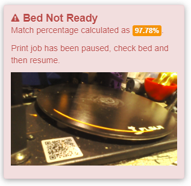
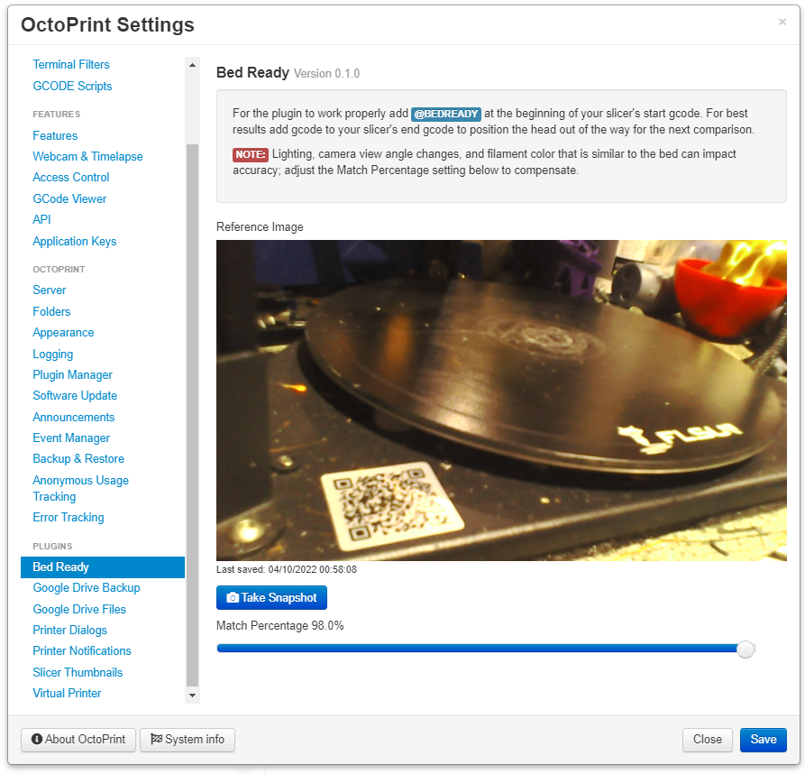

# OctoPrint-BedReady

Plugin that uses the camera and opencv to determine if the bed matches a reference image indicating that the bed is clear and ready to start a print.



For the plugin to work properly add `@BEDREADY` at the beginning of your slicer's start gcode. As of version 0.2.0 you can also pass a filename and match percentage along with the command, `@BEDREADY filename.jpg 0.8`. This is helpful for having multiple reference images for different types of bed surfaces, and adding the GCODE into the filament specific start gcode settings.

**TIP**: For best results add gcode to your slicer's end gcode to position the head out of the way for the next comparison.

**NOTE:** Lighting, camera view angle changes, and filament color that is similar to the bed can impact accuracy; adjust the Match Percentage setting to compensate.

## Setup

Install via the bundled [Plugin Manager](https://docs.octoprint.org/en/master/bundledplugins/pluginmanager.html)
or manually using this URL:

    https://github.com/jneilliii/OctoPrint-BedReady/archive/master.zip

## Configuration



Use the Test Snapshot button to compare the currently selected default Reference Image with the bed.


## Plugin Helpers

As of version 0.2.0 there are also plugin helpers available for other plugins to utilize the comparison functions.

```
def on_after_startup(self):
  helpers = self._plugin_manager.get_helpers("bedready", "check_bed", "take_snapshot")
  if helpers and "check_bed" in helpers:
    self.check_bed = helpers["check_bed"]
  if helpers and "take_snapshot" in helpers:
    self.take_snapshot = helpers["take_snapshot"]

# Later in the plugin....

self.take_snapshot("new_snapshot.jpg")
self.check_bed("new_snapshot.jpg", 0.8)
```

## Get Help

If you experience issues with this plugin or need assistance please use the issue tracker by clicking issues above.

## Additional Plugins

Check out my other plugins [here](https://plugins.octoprint.org/by_author/#jneilliii)

---

## Sponsors
- Andreas Lindermayr
- [@TheTuxKeeper](https://github.com/thetuxkeeper)
- [@tideline3d](https://github.com/tideline3d/)
- [Andrew Beeman](https://github.com/Kiendeleo)
- [Calanish](https://github.com/calanish)
- [Lachlan Bell](https://lachy.io/)
- [Johnny Bergdal](https://github.com/bergdahl)
- [Leigh Johnson](https://github.com/leigh-johnson)
- [Stephen Berry](https://github.com/berrystephenw)
- [Steve Dougherty](https://github.com/Thynix)
## Support My Efforts
I, jneilliii, programmed this plugin for fun and do my best effort to support those that have issues with it, please return the favor and leave me a tip or become a Patron if you find this plugin helpful and want me to continue future development.

[](https://www.patreon.com/jneilliii) [](https://paypal.me/jneilliii) [](https://github.com/sponsors/jneilliii)

<small>No paypal.me? Send funds via PayPal to jneilliii&#64;gmail&#46;com

You can use [this](https://www.paypal.com/cgi-bin/webscr?cmd=_xclick&business=jneilliii@gmail.com) link too. But the normal PayPal fee will be deducted.
</small>
